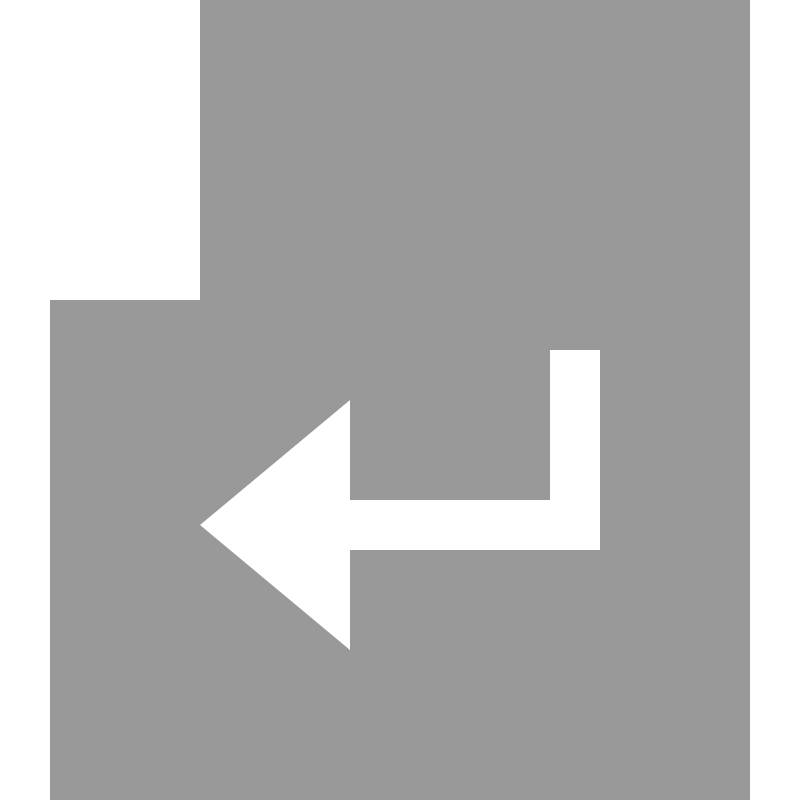

#  What is Middle?

Middle is a tool for this repository that can make find images much fast, here you can find Middle's code.

#### How I use it?

You can use it for find the images much fast.

**How I make it?**

1. Go to the first page of this repository
2. Find a search with the text "Middle"
3. Put an preset name
- And you have the preset pressing 